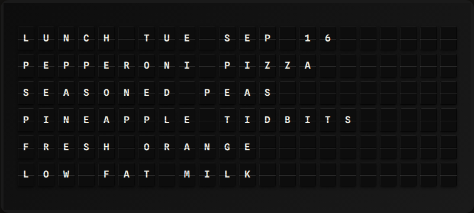

# School Lunch Menu Plugin

Display your school's lunch menu from [Nutrislice](https://www.nutrislice.com/), the menu platform used by many US school districts.

**→ [Setup Guide](./docs/SETUP.md)** - Configuration instructions

## Overview

The School Lunch Menu plugin fetches the published week's menu from your district's Nutrislice site and shows the next school day's items on your board. After a configurable hour it rolls over to the next day, so the board stops advertising a lunch that has already been served. Weekends and days with no published menu are skipped automatically (up to a week ahead), and no-school days are surfaced as their own message.



No API key is required.

## Template Variables

```
{{school_lunch.menu_date}}       # "Sep 16"
{{school_lunch.menu_weekday}}    # "Tuesday"
{{school_lunch.is_today}}        # "true" when the menu shown is today's
{{school_lunch.headline}}        # First entree, truncated to 22 chars
{{school_lunch.items_text}}      # Item names joined with ", "
{{school_lunch.item_count}}      # Number of items exposed
{{school_lunch.no_school}}       # "true" on a no-school day
{{school_lunch.no_school_text}}  # e.g. "Teacher In-Service Day"

{{school_lunch.items.0.name}}    # Item name
{{school_lunch.items.0.section}} # Section the item appeared under
```

## Example Templates

### Daily Menu

```
LUNCH {{school_lunch.menu_weekday}} {{school_lunch.menu_date}}
{{school_lunch.items.0.name}}
{{school_lunch.items.1.name}}
{{school_lunch.items.2.name}}
{{school_lunch.items.3.name}}
```

### Headline Only

```
{center}TODAY'S LUNCH
{center}{{school_lunch.headline|wrap}}
```

### Note (3x15)

```
{{school_lunch.menu_date}}
{{school_lunch.headline}}
{{school_lunch.items.1.name}}
```

## Default Display

If you don't build a template, the plugin renders:

```
LUNCH TUE SEP 16
Pepperoni Pizza
Seasoned Peas
Pineapple Tidbits
```

or, on a no-school day:

```
LUNCH WED SEP 16
NO SCHOOL
Teacher In-Service Day
```

## Configuration

| Setting | Type | Default | Description |
|---------|------|---------|-------------|
| enabled | boolean | false | Enable/disable the plugin |
| district | string | — | District subdomain, e.g. `lwsd` (required) |
| school | string | — | School slug, e.g. `cougar-creek-elementary` (required) |
| menu_type | string | `lunch` | Menu type slug, e.g. `lunch` or `breakfast` |
| timezone | string | `America/Los_Angeles` | IANA timezone used to pick the day |
| max_items | integer | 4 | Menu items to expose (1–6) |
| show_tomorrow_after_hour | integer | 13 | From this hour, show the next school day |
| refresh_seconds | integer | 3600 | Refresh interval (minimum 900) |

See [docs/SETUP.md](./docs/SETUP.md) for how to find your district and school slugs.

## API

This plugin uses the public Nutrislice menu API:

```
GET https://<district>.api.nutrislice.com/menu/api/weeks/school/<school>/menu-type/<menu-type>/<YYYY>/<MM>/<DD>/
```

No API key is required. The endpoint returns the whole week containing the requested date, so a normal refresh is a single request. Nutrislice publishes no documented rate limit; the 900-second minimum refresh keeps usage well within reason.

## Development

```bash
pip install -r requirements-dev.txt
pytest tests/ -v --cov=. --cov-report=term-missing
```

## Author

FiestaBoard Team
